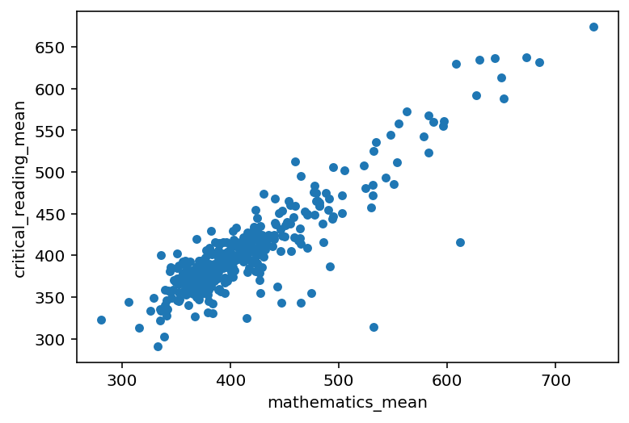

## Utilities for data.gov datasets

### Overview

Removes some overhead with downloading and parsing datasets from [data.gov](https://data.gov/).
Supports loading json datasets over http or locally into pandas dataframes. Also supports
chunked iteration/streaming.

### Installation / Usage

```bash
pip install git+git://github.com/aminnj/datagovutils.git#egg=datagovutils -U
```

### Examples

[](https://mybinder.org/v2/gh/aminnj/datagovutils/master?filepath=examples%2Fnycsat.ipynb)

```python
from datagovutils import Dataset

ds = Dataset("https://data.cityofnewyork.us/api/views/zt9s-n5aj/rows.json?accessType=DOWNLOAD")
ds.meta_df()
```
<div>
<table border="1" class="dataframe">
  <thead>
    <tr style="text-align: right;">
      <th></th>
      <th>name</th>
      <th>category</th>
      <th>createdAt</th>
      <th>description</th>
      <th>downloadCount</th>
      <th>oid</th>
      <th>publicationDate</th>
      <th>tableId</th>
    </tr>
  </thead>
  <tbody>
    <tr>
      <th>1</th>
      <td>SAT (College Board) 2010 School Level Results</td>
      <td>Education</td>
      <td>1317924832</td>
      <td>New York City school level College Board SAT r...</td>
      <td>12012</td>
      <td>502721</td>
      <td>1556209725</td>
      <td>290785</td>
    </tr>
  </tbody>
</table>
</div>

```python
ds.column_df()
```
<div>

<table border="1" class="dataframe">
  <thead>
    <tr style="text-align: right;">
      <th></th>
      <th>fieldName</th>
      <th>position</th>
      <th>renderTypeName</th>
    </tr>
  </thead>
  <tbody>
    <tr>
      <th>0</th>
      <td>dbn</td>
      <td>1</td>
      <td>text</td>
    </tr>
    <tr>
      <th>1</th>
      <td>school_name</td>
      <td>2</td>
      <td>text</td>
    </tr>
    <tr>
      <th>2</th>
      <td>number_of_test_takers</td>
      <td>3</td>
      <td>number</td>
    </tr>
    <tr>
      <th>3</th>
      <td>critical_reading_mean</td>
      <td>4</td>
      <td>number</td>
    </tr>
    <tr>
      <th>4</th>
      <td>mathematics_mean</td>
      <td>5</td>
      <td>number</td>
    </tr>
    <tr>
      <th>5</th>
      <td>writing_mean</td>
      <td>6</td>
      <td>number</td>
    </tr>
  </tbody>
</table>
</div>

```python
(ds.data_df()
 .filter(like="mean",axis=1)
 .astype(float)
 .dropna()
 .plot.scatter(x="mathematics_mean",y="critical_reading_mean")
)
```

